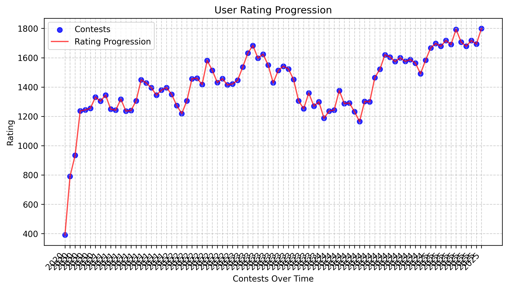
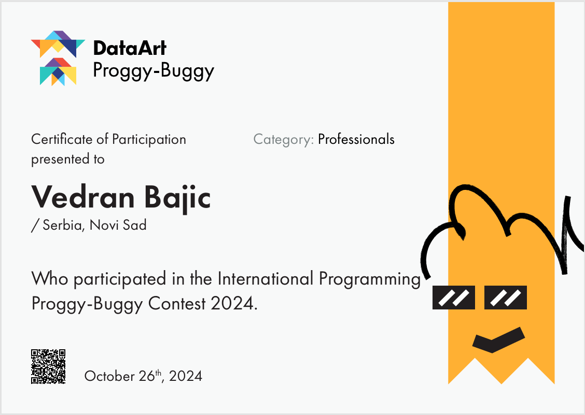

# Competitive Programming Tracker

## 🚀 Introduction
This repository documents my journey in Competitive Programming. I have been actively 
solving problems, participating in contests, and learning new algorithms and data structures since I was age 15.
I've used platforms such as Codeforces, CodeChef, LeetCode for practicing online, but also
competing in regional contests.

Python script is used to scrap and update this *Readme file*, modifiyng my rating and rank on given platforms.

## Features

- 🧑‍💻 Get user info (rank, rating, etc.)
- ✔️ Track solved problems
- 📊 Visualize progress over time

## CodeForces

- **Username:** [veks_the_boss]
- **Current Rating:** [1799]
- **Max Rating:** [1799]
- **Rank:** [expert]
- **Contests Participated:** [83]
- **Problems Solved:** [414]

Below is the python script generated plot, showing my contest rating changes

## CodeChef
- **Current Rating:** [1794]
- **Contests Participated:** [60]
- **Problems Solved:** [346]
- **Contests Participated:** [60]
- **Problems Solved:** [317]

## BubbleCup

[BubbleCup](https://www.bubblecup.org/) cup is team-based programming competition organized by **Microsoft** (Microsoft Development Center Serbia). The contest is held every
year and has 2 phases: **Qualification round** (online), and **Final round**(in Belgrade). Also there are two categories, **Rising stars** (High school students) and **Premier League** (College students up to 26 years).

I've been competing in both categories, through whole high school (with Nemanja Majski and Aleksandar Gubica) and now my current team is with two colleague from University Lazar and Milan Sazdov.

>**Note** Certificate

## CodeIT

[CodeIT](https://codeit.bg/eng), organized by the software company Musala Soft, part of Qinshift, is one of the first private competitions 
in Informatics in the world. Founded in 2000 as a national competition, today CodeIT gathers hundreds of 
competitors from Bulgaria and the world. 6 online rounds, 12 finalists, many partners, one grand final and an inspiring IT guru every year.

I have been on 2 finals: 2023. and 2022.

>**Note** Certificate

## Others

Because of my passion for competitive programming and algoriths, I have been on several more contests that 
are organized by IT companies. 

